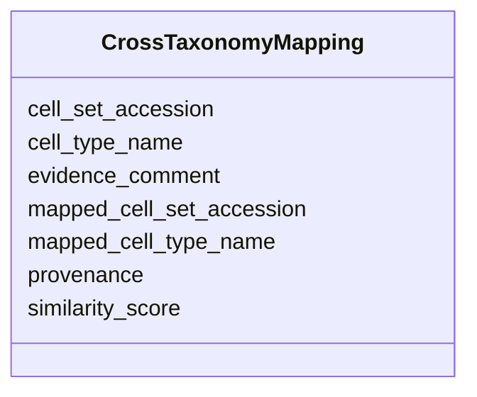

# Class: CrossTaxonomyMapping


URI: [ccn2:CrossTaxonomyMapping](https://github.com/brain-bican/CCN2CrossTaxonomyMapping)





<!-- no inheritance hierarchy -->


## Slots

| Name | Cardinality and Range | Description | Inheritance |
| ---  | --- | --- | --- |
| [cell_set_accession](cell_set_accession.md) | 1..1 <br/> [String](String.md) | Primary identifier for cell set | direct |
| [cell_type_name](cell_type_name.md) | 1..1 <br/> [String](String.md) | The primary name/symbol to be used for the cell type defined by this cell set | direct |
| [mapped_cell_set_accession](mapped_cell_set_accession.md) | 1..1 <br/> [String](String.md) | The accession (ID) of a cell set in a second taxonomy that this cell set maps... | direct |
| [mapped_cell_type_name](mapped_cell_type_name.md) | 1..1 <br/> [String](String.md) | The name of the cell type corresponding to the mapped_cell_set_accession | direct |
| [evidence_comment](evidence_comment.md) | 1..1 <br/> [String](String.md) | A free text description of the evidence supporting this mapping | direct |
| [similarity_score](similarity_score.md) | 0..1 <br/> [Float](Float.md) | A score recording the similarity between mapped nodes | direct |
| [provenance](provenance.md) | 0..1 <br/> [String](String.md) | ORCID of the person doing the mapping using the syntax ORCID:0123-4567-890 | direct |


## Identifier and Mapping Information


### Schema Source


* from schema: CCN2


## Mappings

| Mapping Type | Mapped Value |
| ---  | ---  |
| self | ccn2:CrossTaxonomyMapping |
| native | ccn2:CrossTaxonomyMapping |


## LinkML Source

<!-- TODO: investigate https://stackoverflow.com/questions/37606292/how-to-create-tabbed-code-blocks-in-mkdocs-or-sphinx -->

### Direct

<details>
```yaml
name: cross taxonomy mapping
from_schema: CCN2
slots:
- cell set accession
- cell type name
- mapped cell set accession
- mapped cell type name
- evidence comment
- similarity score
- provenance
slot_usage:
  cell set accession:
    name: cell set accession
    domain_of:
    - taxonomy
    - cross taxonomy mapping
    - location mapping
    required: true
  cell type name:
    name: cell type name
    domain_of:
    - taxonomy
    - cross taxonomy mapping
    - location mapping
    required: true
  mapped cell set accession:
    name: mapped cell set accession
    domain_of:
    - cross taxonomy mapping
    required: true
  mapped cell type name:
    name: mapped cell type name
    domain_of:
    - cross taxonomy mapping
    required: true
  evidence comment:
    name: evidence comment
    description: A free text description of the evidence supporting this mapping.
      If a similarity_score is include, please also include details of how this was
      calculated.
    domain_of:
    - cross taxonomy mapping
    - location mapping
    required: true

```
</details>

### Induced

<details>
```yaml
name: cross taxonomy mapping
from_schema: CCN2
slot_usage:
  cell set accession:
    name: cell set accession
    domain_of:
    - taxonomy
    - cross taxonomy mapping
    - location mapping
    required: true
  cell type name:
    name: cell type name
    domain_of:
    - taxonomy
    - cross taxonomy mapping
    - location mapping
    required: true
  mapped cell set accession:
    name: mapped cell set accession
    domain_of:
    - cross taxonomy mapping
    required: true
  mapped cell type name:
    name: mapped cell type name
    domain_of:
    - cross taxonomy mapping
    required: true
  evidence comment:
    name: evidence comment
    description: A free text description of the evidence supporting this mapping.
      If a similarity_score is include, please also include details of how this was
      calculated.
    domain_of:
    - cross taxonomy mapping
    - location mapping
    required: true
attributes:
  cell set accession:
    name: cell set accession
    description: Primary identifier for cell set.
    from_schema: CCN2
    rank: 1000
    alias: cell_set_accession
    owner: cross taxonomy mapping
    domain_of:
    - taxonomy
    - cross taxonomy mapping
    - location mapping
    range: string
    required: true
  cell type name:
    name: cell type name
    description: The primary name/symbol to be used for the cell type defined by this
      cell set.
    from_schema: CCN2
    rank: 1000
    alias: cell_type_name
    owner: cross taxonomy mapping
    domain_of:
    - taxonomy
    - cross taxonomy mapping
    - location mapping
    range: string
    required: true
  mapped cell set accession:
    name: mapped cell set accession
    description: The accession (ID) of a cell set in a second taxonomy that this cell
      set maps to.
    from_schema: CCN2
    rank: 1000
    alias: mapped_cell_set_accession
    owner: cross taxonomy mapping
    domain_of:
    - cross taxonomy mapping
    range: string
    required: true
  mapped cell type name:
    name: mapped cell type name
    description: The name of the cell type corresponding to the mapped_cell_set_accession.
    from_schema: CCN2
    rank: 1000
    alias: mapped_cell_type_name
    owner: cross taxonomy mapping
    domain_of:
    - cross taxonomy mapping
    range: string
    required: true
  evidence comment:
    name: evidence comment
    description: A free text description of the evidence supporting this mapping.
      If a similarity_score is include, please also include details of how this was
      calculated.
    from_schema: CCN2
    rank: 1000
    alias: evidence_comment
    owner: cross taxonomy mapping
    domain_of:
    - cross taxonomy mapping
    - location mapping
    range: string
    required: true
  similarity score:
    name: similarity score
    description: A score recording the similarity between mapped nodes.
    from_schema: CCN2
    rank: 1000
    alias: similarity_score
    owner: cross taxonomy mapping
    domain_of:
    - cross taxonomy mapping
    range: float
    minimum_value: 0
    maximum_value: 1
  provenance:
    name: provenance
    description: ORCID of the person doing the mapping using the syntax ORCID:0123-4567-890.
      Optionally include supporting publications using DOIs of the form doi:10.1126/journal.abj6641.
    from_schema: CCN2
    rank: 1000
    alias: provenance
    owner: cross taxonomy mapping
    domain_of:
    - cross taxonomy mapping
    - location mapping
    range: string

```
</details>