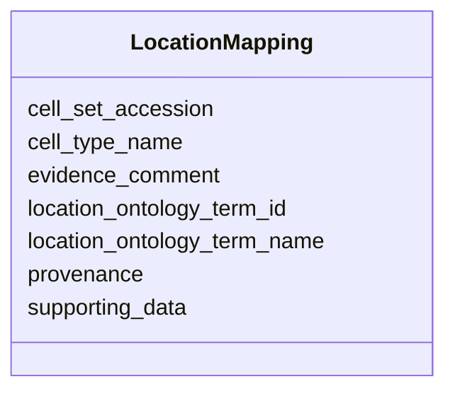

# Class: LocationMapping


URI: [ccn2:LocationMapping](https://github.com/brain-bican/CCN2LocationMapping)





<!-- no inheritance hierarchy -->


## Slots

| Name | Cardinality and Range | Description | Inheritance |
| ---  | --- | --- | --- |
| [cell_set_accession](cell_set_accession.md) | 1..1 <br/> [String](String.md) | Primary identifier for cell set | direct |
| [cell_type_name](cell_type_name.md) | 1..1 <br/> [String](String.md) | The primary name/symbol to be used for the cell type defined by this cell set | direct |
| [location_ontology_term_id](location_ontology_term_id.md) | 1..1 <br/> [String](String.md) | The ID of an ontology term that refers to a brain region that this cell type ... | direct |
| [location_ontology_term_name](location_ontology_term_name.md) | 1..1 <br/> [String](String.md) | Name of the term whose ID is recorded in the ontology_term_id field | direct |
| [evidence_comment](evidence_comment.md) | 0..1 <br/> [String](String.md) | A comment describing the evidence for this location mapping | direct |
| [supporting_data](supporting_data.md) | 0..1 <br/> [String](String.md) | A link to data supporting this location mapping | direct |
| [provenance](provenance.md) | 1..1 <br/> [String](String.md) | ORCID of the person doing the mapping using the syntax ORCID:0123-4567-890 | direct |


## Identifier and Mapping Information


### Schema Source


* from schema: CCN2


## Mappings

| Mapping Type | Mapped Value |
| ---  | ---  |
| self | ccn2:LocationMapping |
| native | ccn2:LocationMapping |


## LinkML Source

<!-- TODO: investigate https://stackoverflow.com/questions/37606292/how-to-create-tabbed-code-blocks-in-mkdocs-or-sphinx -->

### Direct

<details>
```yaml
name: location mapping
from_schema: CCN2
slots:
- cell set accession
- cell type name
- location ontology term id
- location ontology term name
- evidence comment
- supporting data
- provenance
slot_usage:
  cell set accession:
    name: cell set accession
    domain_of:
    - taxonomy
    - cross taxonomy mapping
    - location mapping
    required: true
  cell type name:
    name: cell type name
    domain_of:
    - taxonomy
    - cross taxonomy mapping
    - location mapping
    required: true
  location ontology term id:
    name: location ontology term id
    domain_of:
    - location mapping
    required: true
  location ontology term name:
    name: location ontology term name
    domain_of:
    - location mapping
    required: true
  evidence comment:
    name: evidence comment
    description: A comment describing the evidence for this location mapping
    domain_of:
    - cross taxonomy mapping
    - location mapping
  provenance:
    name: provenance
    domain_of:
    - cross taxonomy mapping
    - location mapping
    required: true

```
</details>

### Induced

<details>
```yaml
name: location mapping
from_schema: CCN2
slot_usage:
  cell set accession:
    name: cell set accession
    domain_of:
    - taxonomy
    - cross taxonomy mapping
    - location mapping
    required: true
  cell type name:
    name: cell type name
    domain_of:
    - taxonomy
    - cross taxonomy mapping
    - location mapping
    required: true
  location ontology term id:
    name: location ontology term id
    domain_of:
    - location mapping
    required: true
  location ontology term name:
    name: location ontology term name
    domain_of:
    - location mapping
    required: true
  evidence comment:
    name: evidence comment
    description: A comment describing the evidence for this location mapping
    domain_of:
    - cross taxonomy mapping
    - location mapping
  provenance:
    name: provenance
    domain_of:
    - cross taxonomy mapping
    - location mapping
    required: true
attributes:
  cell set accession:
    name: cell set accession
    description: Primary identifier for cell set.
    from_schema: CCN2
    rank: 1000
    alias: cell_set_accession
    owner: location mapping
    domain_of:
    - taxonomy
    - cross taxonomy mapping
    - location mapping
    range: string
    required: true
  cell type name:
    name: cell type name
    description: The primary name/symbol to be used for the cell type defined by this
      cell set.
    from_schema: CCN2
    rank: 1000
    alias: cell_type_name
    owner: location mapping
    domain_of:
    - taxonomy
    - cross taxonomy mapping
    - location mapping
    range: string
    required: true
  location ontology term id:
    name: location ontology term id
    description: The ID of an ontology term that refers to a brain region that this
      cell type is located in. Ideally this should be the ID of a term defined as
      a region in a standard atlas.
    from_schema: CCN2
    rank: 1000
    alias: location_ontology_term_id
    owner: location mapping
    domain_of:
    - location mapping
    range: string
    required: true
  location ontology term name:
    name: location ontology term name
    description: Name of the term whose ID is recorded in the ontology_term_id field.
    from_schema: CCN2
    rank: 1000
    alias: location_ontology_term_name
    owner: location mapping
    domain_of:
    - location mapping
    range: string
    required: true
  evidence comment:
    name: evidence comment
    description: A comment describing the evidence for this location mapping
    from_schema: CCN2
    rank: 1000
    alias: evidence_comment
    owner: location mapping
    domain_of:
    - cross taxonomy mapping
    - location mapping
    range: string
  supporting data:
    name: supporting data
    description: A link to data supporting this location mapping.
    from_schema: CCN2
    rank: 1000
    alias: supporting_data
    owner: location mapping
    domain_of:
    - location mapping
    range: string
  provenance:
    name: provenance
    description: ORCID of the person doing the mapping using the syntax ORCID:0123-4567-890.
      Optionally include supporting publications using DOIs of the form doi:10.1126/journal.abj6641.
    from_schema: CCN2
    rank: 1000
    alias: provenance
    owner: location mapping
    domain_of:
    - cross taxonomy mapping
    - location mapping
    range: string
    required: true

```
</details>