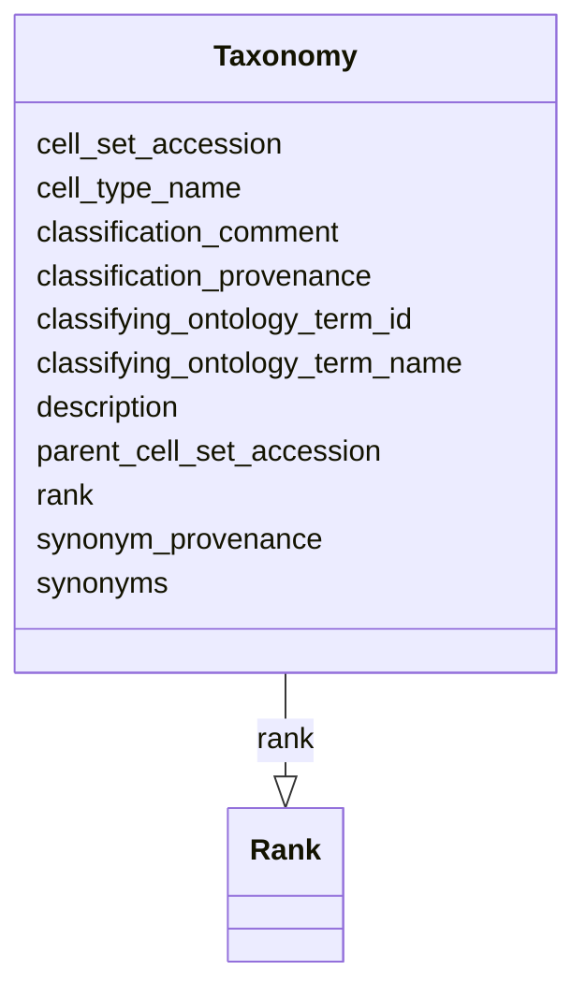

# Class: Taxonomy


URI: [ccn2:Taxonomy](https://github.com/brain-bican/CCN2Taxonomy)





<!-- no inheritance hierarchy -->


## Slots

| Name | Cardinality and Range | Description | Inheritance |
| ---  | --- | --- | --- |
| [cell_set_accession](cell_set_accession.md) | 1..1 <br/> [String](String.md) | Primary identifier of the cell set | direct |
| [cell_type_name](cell_type_name.md) | 0..1 <br/> [String](String.md) | The primary name/symbol to be used for the (provisional) cell type defined by... | direct |
| [parent_cell_set_accession](parent_cell_set_accession.md) | 1..1 <br/> [String](String.md) | The cell set accession of the parent cell set in the taxonomy | direct |
| [synonyms](synonyms.md) | 0..1 <br/> [String](String.md) | A list of alternative names for this cell type | direct |
| [synonym_provenance](synonym_provenance.md) | 0..1 <br/> [String](String.md) | Each entry in the synonyms field should have a corresponding entry here, eith... | direct |
| [description](description.md) | 0..1 <br/> [String](String.md) | Optional free text description of the cluster | direct |
| [classifying_ontology_term_id](classifying_ontology_term_id.md) | 0..1 <br/> [String](String.md) | The ID of an ontology term that classifies the cell type defined by this node | direct |
| [classifying_ontology_term_name](classifying_ontology_term_name.md) | 1..1 <br/> [String](String.md) | The name of the ontology term in the classification_id column | direct |
| [classification_provenance](classification_provenance.md) | 1..1 <br/> [String](String.md) | Either the DOI(s) of a supporting publication (in the form the form doi:10 | direct |
| [classification_comment](classification_comment.md) | 0..1 <br/> [String](String.md) | A free text comment describing the evidence for this classification | direct |
| [rank](rank.md) | 0..1 <br/> [Rank](Rank.md) | Algorithmically generated hierarchical taxonomies can be complex, with many n... | direct |


## Identifier and Mapping Information


### Schema Source


* from schema: CCN2


## Mappings

| Mapping Type | Mapped Value |
| ---  | ---  |
| self | ccn2:Taxonomy |
| native | ccn2:Taxonomy |


## LinkML Source

<!-- TODO: investigate https://stackoverflow.com/questions/37606292/how-to-create-tabbed-code-blocks-in-mkdocs-or-sphinx -->

### Direct

<details>
```yaml
name: taxonomy
from_schema: CCN2
slots:
- cell set accession
- cell type name
- parent cell set accession
- synonyms
- synonym provenance
- description
- classifying ontology term id
- classifying ontology term name
- classification provenance
- classification comment
- rank
slot_usage:
  cell set accession:
    name: cell set accession
    description: Primary identifier of the cell set. This field should be programmatically
      assigned, not edited.
    readonly: 'True'
    domain_of:
    - taxonomy
    - cross taxonomy mapping
    - location mapping
    required: true
  cell type name:
    name: cell type name
    description: The primary name/symbol to be used for the (provisional) cell type
      defined by this cell set. This is left optional, but is strongly encouraged
      for every node that is linked.
    domain_of:
    - taxonomy
    - cross taxonomy mapping
    - location mapping
  parent cell set accession:
    name: parent cell set accession
    domain_of:
    - taxonomy
    required: true
  classifying ontology term name:
    name: classifying ontology term name
    domain_of:
    - taxonomy
    required: true
  classification provenance:
    name: classification provenance
    domain_of:
    - taxonomy
    required: true

```
</details>

### Induced

<details>
```yaml
name: taxonomy
from_schema: CCN2
slot_usage:
  cell set accession:
    name: cell set accession
    description: Primary identifier of the cell set. This field should be programmatically
      assigned, not edited.
    readonly: 'True'
    domain_of:
    - taxonomy
    - cross taxonomy mapping
    - location mapping
    required: true
  cell type name:
    name: cell type name
    description: The primary name/symbol to be used for the (provisional) cell type
      defined by this cell set. This is left optional, but is strongly encouraged
      for every node that is linked.
    domain_of:
    - taxonomy
    - cross taxonomy mapping
    - location mapping
  parent cell set accession:
    name: parent cell set accession
    domain_of:
    - taxonomy
    required: true
  classifying ontology term name:
    name: classifying ontology term name
    domain_of:
    - taxonomy
    required: true
  classification provenance:
    name: classification provenance
    domain_of:
    - taxonomy
    required: true
attributes:
  cell set accession:
    name: cell set accession
    description: Primary identifier of the cell set. This field should be programmatically
      assigned, not edited.
    from_schema: CCN2
    rank: 1000
    readonly: 'True'
    alias: cell_set_accession
    owner: taxonomy
    domain_of:
    - taxonomy
    - cross taxonomy mapping
    - location mapping
    range: string
    required: true
  cell type name:
    name: cell type name
    description: The primary name/symbol to be used for the (provisional) cell type
      defined by this cell set. This is left optional, but is strongly encouraged
      for every node that is linked.
    from_schema: CCN2
    rank: 1000
    alias: cell_type_name
    owner: taxonomy
    domain_of:
    - taxonomy
    - cross taxonomy mapping
    - location mapping
    range: string
  parent cell set accession:
    name: parent cell set accession
    description: The cell set accession of the parent cell set in the taxonomy. This
      field should be programmatically assigned, not edited.
    from_schema: CCN2
    rank: 1000
    alias: parent_cell_set_accession
    owner: taxonomy
    domain_of:
    - taxonomy
    range: string
    required: true
  synonyms:
    name: synonyms
    description: A list of alternative names for this cell type. Separate entries
      with a '|'. Do not use terms with a scope that is much narrower or broader than
      the cell type being described.
    from_schema: CCN2
    rank: 1000
    alias: synonyms
    owner: taxonomy
    domain_of:
    - taxonomy
    range: string
  synonym provenance:
    name: synonym provenance
    description: 'Each entry in the synonyms field should have a corresponding entry
      here, either the DOI of a supporting publication (in the form the form doi:10.1126/journal.abj6641)
      or the editor''s ORCID (in the form: ORCID:01243-234-678). Multiple entries
      should be separated by a ''|''.'
    from_schema: CCN2
    rank: 1000
    alias: synonym_provenance
    owner: taxonomy
    domain_of:
    - taxonomy
    range: string
  description:
    name: description
    description: Optional free text description of the cluster. This could be particularly
      useful for describing the properties of cells clustered from techniques that
      provide data on morphology, function and connectivity, e.g. patch-seq & epi-retro-seq.
    from_schema: CCN2
    rank: 1000
    alias: description
    owner: taxonomy
    domain_of:
    - taxonomy
    range: string
  classifying ontology term id:
    name: classifying ontology term id
    description: The ID of an ontology term that classifies the cell type defined
      by this node.
    from_schema: CCN2
    rank: 1000
    alias: classifying_ontology_term_id
    owner: taxonomy
    domain_of:
    - taxonomy
    range: string
  classifying ontology term name:
    name: classifying ontology term name
    description: The name of the ontology term in the classification_id column
    from_schema: CCN2
    rank: 1000
    alias: classifying_ontology_term_name
    owner: taxonomy
    domain_of:
    - taxonomy
    range: string
    required: true
  classification provenance:
    name: classification provenance
    description: 'Either the DOI(s) of a supporting publication (in the form the form
      doi:10.1126/journal.abj6641) or the editor''s ORCID (in the form: ORCID:01243-234-678).
      Multiple entries should be separated by a ''|''.'
    from_schema: CCN2
    rank: 1000
    alias: classification_provenance
    owner: taxonomy
    domain_of:
    - taxonomy
    range: string
    required: true
  classification comment:
    name: classification comment
    description: A free text comment describing the evidence for this classification.
    from_schema: CCN2
    rank: 1000
    alias: classification_comment
    owner: taxonomy
    domain_of:
    - taxonomy
    range: string
  rank:
    name: rank
    description: Algorithmically generated hierarchical taxonomies can be complex,
      with many nodes between root and leaf and branches of variable depth. To simplify
      this for display and discussion it can be useful to assign nodes to a 3 level
      hierarchy, with leaf nodes at the bottom.
    from_schema: CCN2
    rank: 1000
    alias: rank
    owner: taxonomy
    domain_of:
    - taxonomy
    range: Rank

```
</details>