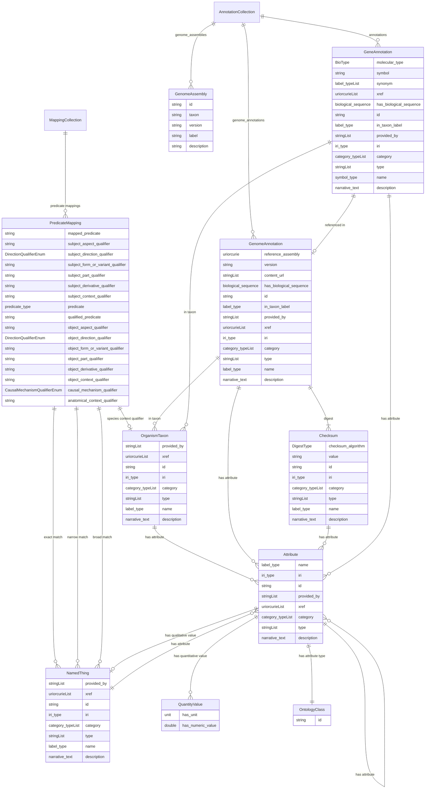

```mermaid
erDiagram
MappingCollection {

}
PredicateMapping {
    string mapped_predicate  
    string subject_aspect_qualifier  
    DirectionQualifierEnum subject_direction_qualifier  
    string subject_form_or_variant_qualifier  
    string subject_part_qualifier  
    string subject_derivative_qualifier  
    string subject_context_qualifier  
    predicate_type predicate  
    string qualified_predicate  
    string object_aspect_qualifier  
    DirectionQualifierEnum object_direction_qualifier  
    string object_form_or_variant_qualifier  
    string object_part_qualifier  
    string object_derivative_qualifier  
    string object_context_qualifier  
    CausalMechanismQualifierEnum causal_mechanism_qualifier  
    string anatomical_context_qualifier  
}
NamedThing {
    stringList provided_by  
    uriorcurieList xref  
    string id  
    iri_type iri  
    category_typeList category  
    stringList type  
    label_type name  
    narrative_text description  
}
Attribute {
    label_type name  
    iri_type iri  
    string id  
    stringList provided_by  
    uriorcurieList xref  
    category_typeList category  
    stringList type  
    narrative_text description  
}
QuantityValue {
    unit has_unit  
    double has_numeric_value  
}
OntologyClass {
    string id  
}
OrganismTaxon {
    stringList provided_by  
    uriorcurieList xref  
    string id  
    iri_type iri  
    category_typeList category  
    stringList type  
    label_type name  
    narrative_text description  
}
AnnotationCollection {

}
GenomeAssembly {
    string id  
    string taxon  
    string version  
    string label  
    string description  
}
GenomeAnnotation {
    uriorcurie reference_assembly  
    string version  
    stringList content_url  
    biological_sequence has_biological_sequence  
    string id  
    label_type in_taxon_label  
    stringList provided_by  
    uriorcurieList xref  
    iri_type iri  
    category_typeList category  
    stringList type  
    label_type name  
    narrative_text description  
}
Checksum {
    DigestType checksum_algorithm  
    string value  
    string id  
    iri_type iri  
    category_typeList category  
    stringList type  
    label_type name  
    narrative_text description  
}
GeneAnnotation {
    BioType molecular_type  
    string symbol  
    label_typeList synonym  
    uriorcurieList xref  
    biological_sequence has_biological_sequence  
    string id  
    label_type in_taxon_label  
    stringList provided_by  
    iri_type iri  
    category_typeList category  
    stringList type  
    symbol_type name  
    narrative_text description  
}

MappingCollection ||--}o PredicateMapping : "predicate mappings"
PredicateMapping ||--|o OrganismTaxon : "species context qualifier"
PredicateMapping ||--}o NamedThing : "exact match"
PredicateMapping ||--}o NamedThing : "narrow match"
PredicateMapping ||--}o NamedThing : "broad match"
NamedThing ||--}o Attribute : "has attribute"
Attribute ||--|| OntologyClass : "has attribute type"
Attribute ||--}o QuantityValue : "has quantitative value"
Attribute ||--|o NamedThing : "has qualitative value"
Attribute ||--}o Attribute : "has attribute"
OrganismTaxon ||--}o Attribute : "has attribute"
AnnotationCollection ||--}o GeneAnnotation : "annotations"
AnnotationCollection ||--}o GenomeAnnotation : "genome_annotations"
AnnotationCollection ||--}o GenomeAssembly : "genome_assemblies"
GenomeAnnotation ||--}| Checksum : "digest"
GenomeAnnotation ||--}o OrganismTaxon : "in taxon"
GenomeAnnotation ||--}o Attribute : "has attribute"
Checksum ||--}o Attribute : "has attribute"
GeneAnnotation ||--|o GenomeAnnotation : "referenced in"
GeneAnnotation ||--}o OrganismTaxon : "in taxon"
GeneAnnotation ||--}o Attribute : "has attribute"

```

